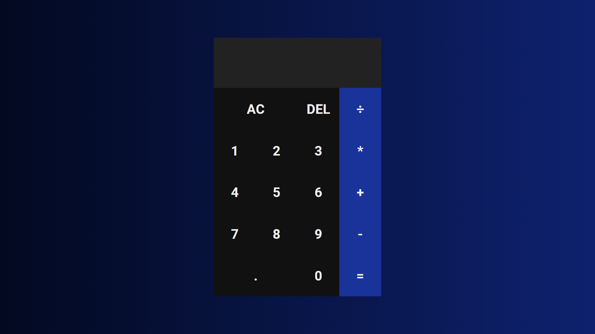

 
  

   🎯 Sobre

<h4 style="padding:20px 0;">Projeto pessoal no qual criei uma simples calculadora.</h4>

<!--sobre-->

   
   🚀 Tecnologias

<h4 style="padding:20px 0;">A seguintes ferramentas e tecnologias foram utilizadas nesse projeto:</h4>

HTML5

CSS3

JAVASCRIPT

 

Feito com ❤️ por David Richard